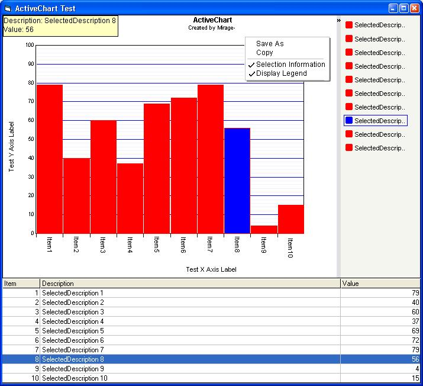



## ActiveChart \(Bar\)

### Description

Updated resize bug. See http://www.planet-source-code.com/vb/scripts/ShowCode.asp?txtCodeId=32583&lngWId=1
 
### More Info
 

             |
---                |---
**Submitted On**   |2002-03-09 19:26:48
**By**             |[Mirage\-](https://github.com/Planet-Source-Code/PSCIndex/blob/master/ByAuthor/mirage.md)
**Level**          |Intermediate
**User Rating**    |5.0 (55 globes from 11 users)
**Compatibility**  |VB 6\.0
**Category**       |[Custom Controls/ Forms/  Menus](https://github.com/Planet-Source-Code/PSCIndex/blob/master/ByCategory/custom-controls-forms-menus__1-4.md)
**World**          |[Visual Basic](https://github.com/Planet-Source-Code/PSCIndex/blob/master/ByWorld/visual-basic.md)
**Archive File**   |[ActiveChar60765392002\.zip](https://github.com/Planet-Source-Code/mirage-activechart-bar__1-32453/archive/master.zip)

